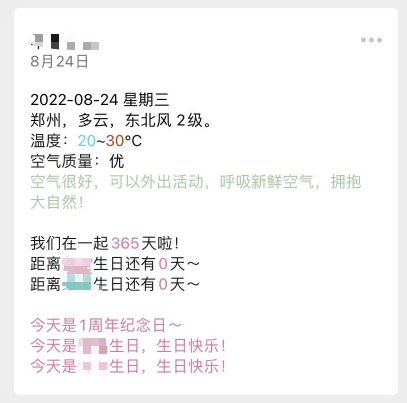
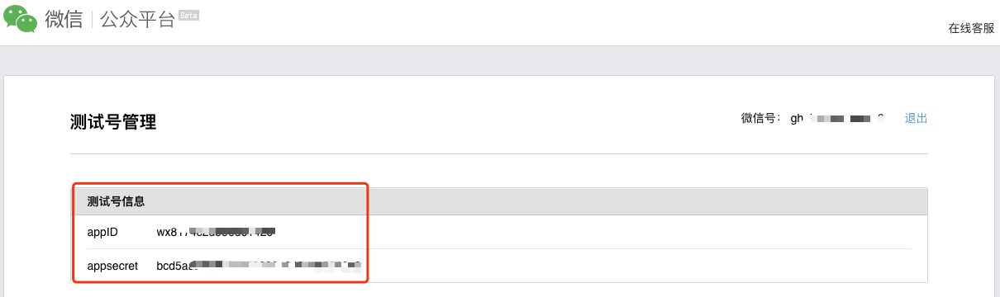
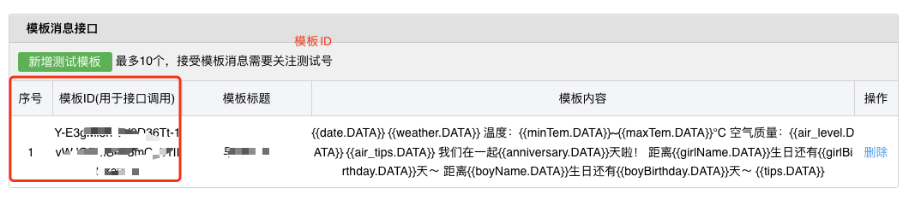

# WeChatPush
微信早安消息推送，Java。

支持农历生日及纪念日计算。



配置文件（application.yaml）介绍：

```yaml
WeChat:
  appid:  #微信测试号appid
  appsecret: #微信测试号appsecret
  template_id: #消息模板id
  openid:  #女朋友的openid 关注测试公众号后后台可查询
Task:
  cron: "0 0 7 * * ?" #cron 控制消息推送时间 当前为每天上午7点，不懂的可以使用在线生成https://cron.qqe2.com/
Weather: #天气接口 tianqiapi.com 
  appid:  #天气接口appid
  appsecret:  #天气接口appsecret
  city: 郑州 #城市
Date:
  anniversary:
    date: 2021/08/24
    isChineseCalendar: false #是否是农历
  boyBirthday:
    name: 小帅 #男生名字
    date: 1998/08/24
    isChineseCalendar: false #是否是农历
  girlBirthday:
    name: 小美 #女生名字
    date: 2000/08/24
    isChineseCalendar: false #是否是农历
```

消息模板：

```
{{date.DATA}} 
{{weather.DATA}} 
温度：{{minTem.DATA}}~{{maxTem.DATA}}°C
空气质量：{{air_level.DATA}} 
{{air_tips.DATA}} 

我们在一起{{anniversary.DATA}}天啦！ 
距离{{girlName.DATA}}生日还有{{girlBirthday.DATA}}天～ 
距离{{boyName.DATA}}生日还有{{boyBirthday.DATA}}天～ 
{{tips.DATA}}
```

微信公众平台测试号地址：https://mp.weixin.qq.com/debug/cgi-bin/sandboxinfo?action=showinfo&t=sandbox/login




